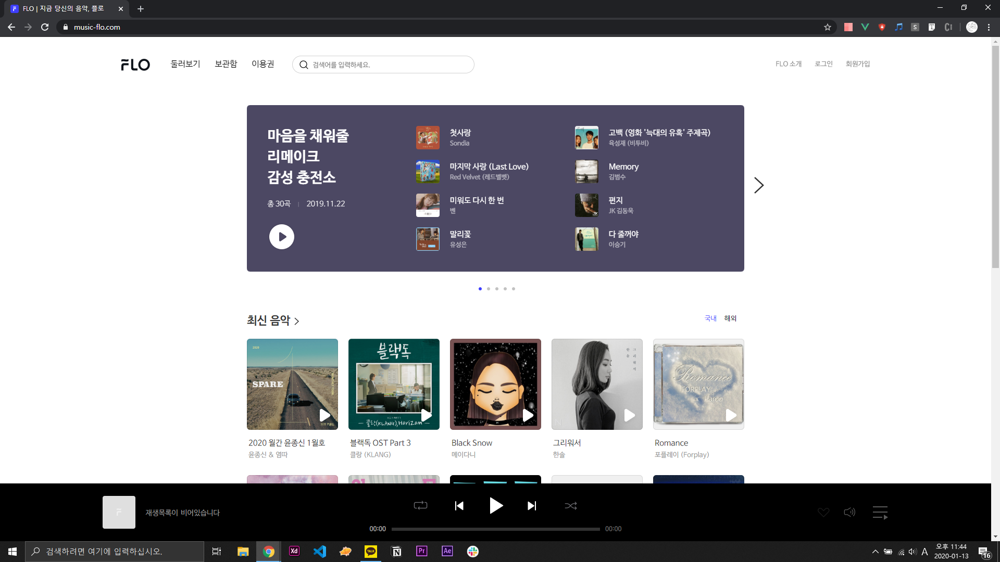

# flo-clonecoding

실력 향상을 위해 FLO'라는 음원 사이트의 프론트엔드를 만들어 봅니다.

## FLO(https://www.music-flo.com/) 최초 접속 화면

---
### 1일차 (2020.01.14)  
#### 네비게이션 바 (헤더) 제작, 슬라이더 테스트

### 2일차 (2020.01.15)  
#### media query를 이용해 헤더 반응형으로 수정

---

## 앞으로 해야될 것들

### 메인 페이지  
~~헤더 만들기~~  
슬라이더 만들기  
'최신 음악' 만들기  
'장르 콜렉션' 만들기  
'Editor's Pick' 만들기  
푸터 만들기  
하단 플레이어 만들기
